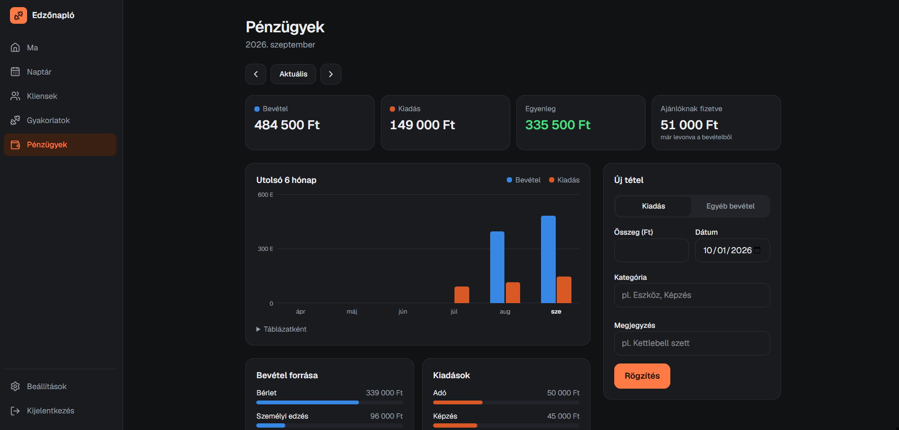
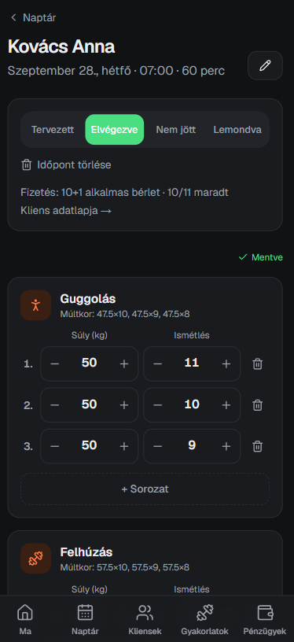
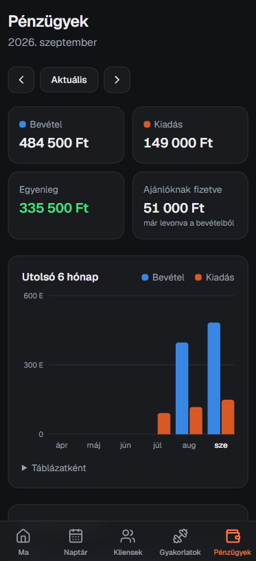

# Edzőnapló – training & business manager for a personal trainer

A web app built for a Hungarian personal trainer who couldn't find an off-the-shelf tool that matched how she actually works. It replaces spreadsheets and notes with one place for **clients, appointments, workout logging, session passes and finances** – and it does the bookkeeping on its own.

The UI is in Hungarian (the users are Hungarian); code comments are mostly Hungarian too.

<p>
  
</p>
<p>
  
  
  
</p>

## Why custom software

Generic trainer apps couldn't model her pricing:

- **Session passes** like *10+1* (pay 10, get 11), *5+½* (6th session half price) and a *12-session* pass
- **Referred clients** coming from another program: a share of everything they pay (e.g. ⅓) goes to the referrer
- **Group classes** paid at a fixed rate per class, regardless of attendance
- **No-show rules**: cancelling in time is free, not showing up is billed (or deducts a pass session)
- **Fixed monthly costs** (tax, gym rent) that should appear in the books automatically

## Features

- **Today** – the day's sessions, monthly income and balance at a glance
- **Calendar** – week view (day list on phones, 7 columns on desktop), weekly repeating bookings, editing and rescheduling
- **Clients** – search, remaining pass sessions, referral setup, per-exercise progress (latest and best set)
- **Workout logging** – designed for use *during* a session on a phone: big steppers, autosave with debouncing, and *"last time"* values prefilled from the client's previous session. Exercises track weight + reps, duration, or weight + duration
- **Finances** – monthly income/expense/balance, referral payouts, a 6-month chart (with tooltip and table view), category breakdowns and manual entries
- **Settings** – session price, group rate, editable pass types, recurring expenses

## Architecture

| Layer | Choice |
|---|---|
| Frontend | Next.js 16 (App Router, React Server Components, Server Actions), React 19, Tailwind CSS 4 |
| Backend | Supabase – Postgres, Auth, Row Level Security |
| Hosting | Vercel (app) · Supabase (data) |
| Tests | Node test runner + PGlite (Postgres compiled to WASM) |

```
src/
  app/(app)/        authenticated screens: today, calendar, clients, workouts, finances, settings
  app/login/        email + password sign-in
  lib/supabase/     server client + session refresh in the Next.js proxy
  components/       shared UI
supabase/
  migrations/       schema, triggers, RLS – applied in order
  seed_demo.sql     realistic demo data relative to "today"
tests/db.test.mjs   business rules tested against the real migrations
```

## Design decisions

**Business rules live in the database, not the UI.** Income, referral deductions and pass consumption are computed by Postgres triggers and a view. Whether a session is marked done, rescheduled, switched from a pass to a single payment or cancelled after the fact, the books follow automatically and can't drift out of sync with the calendar. Auto-generated ledger rows are read-only in the UI for the same reason.

**Money is recorded when it actually arrives.** A pass is income on the day it's bought; sessions on a pass only decrement the balance. Single sessions and group classes become income when completed (or when the client no-shows).

**Historical data is immutable by design.** A sold pass snapshots its name, size and price, so later price changes never rewrite the past. Clients are archived rather than deleted.

**Security is enforced in Postgres.** Every table has a row-level security policy scoped to the signed-in user; server actions re-check the session, and the Next.js proxy is only an optimistic redirect. A test verifies that one account can neither read nor modify another's data.

**Built for the actual usage context.** The workout screen is used one-handed between sets, so there's no save button to forget: edits are saved automatically, rapid taps are debounced, and a status indicator shows whether everything is saved.

**Time zones are explicit.** Appointments are stored as `timestamptz` and booked in Europe/Budapest, including DST transitions; a 23:30 session counts toward that day's income, not the next.

## Running locally

1. Create a Supabase project and run the files in `supabase/migrations/` in order in the SQL editor.
2. Create the trainer's account (Authentication → Users → Add user) and **disable public sign-ups**.
3. Copy `.env.example` to `.env.local` and fill in the project URL and publishable key.
4. `npm install` and `npm run dev`.
5. Optional: run `supabase/seed_demo.sql` (set the e-mail at the top) to get six weeks of realistic demo data.

## Tests

```bash
npm run test:db
```

Spins up an in-memory Postgres (PGlite), applies every migration and checks the business rules: pass consumption, referral split, no-show billing, group-class income, Budapest-time bookkeeping, idempotent monthly expenses and row-level security.
